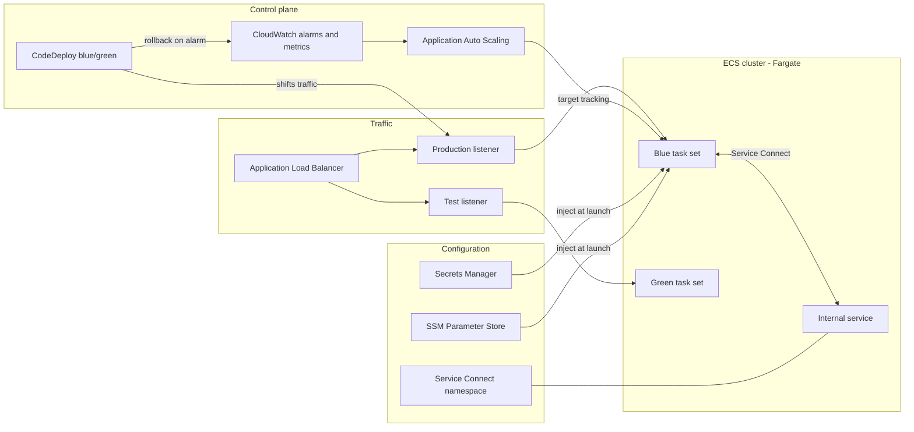

# aws-ecs-fargate-platform

A production-oriented Amazon ECS on AWS Fargate platform, delivered as reusable
Terraform. It provides a hardened cluster foundation and composable modules for
running containerized services with autoscaling, private service-to-service
networking, secret injection, and safe progressive rollouts.

## Capabilities

- **Cluster foundation** — an ECS cluster wired to the `FARGATE` and
  `FARGATE_SPOT` capacity providers with a tunable default strategy, plus
  Container Insights for cluster and task metrics and encrypted, audited
  ECS Exec sessions.
- **Reusable service module** — task definition, service, ALB target group, and
  target-tracking autoscaling behind a small input surface.
- **Private service networking** — ECS Service Connect for service discovery and
  service-to-service traffic without exposing internal endpoints.
- **Configuration and secrets** — Secrets Manager and SSM Parameter Store values
  injected into task definitions at launch rather than baked into images.
- **Safe rollouts** — in-place deployments guarded by a circuit breaker, or
  CodeDeploy blue/green traffic shifting with a test listener, canary and linear
  shift configurations, and automatic rollback on alarm.

## Architecture at a glance



The full component walkthrough, traffic flows, and design decisions are in
[docs/architecture.md](docs/architecture.md).

## Repository layout

| Path | Purpose |
|------|---------|
| `versions.tf` | Terraform and provider version constraints |
| `providers.tf` | AWS provider configuration and default tags |
| `variables.tf` | Root input variables (region, naming, environment, tags) |
| `modules/ecs-cluster/` | ECS cluster with Fargate capacity providers, Container Insights, and encrypted ECS Exec |
| `modules/service/` | Reusable service: task definition, ALB target group, and target-tracking autoscaling |
| `modules/service-connect/` | Cloud Map namespace for ECS Service Connect service discovery |
| `modules/blue-green/` | CodeDeploy blue/green traffic shifting, deployment gating, and rollback alarms |
| `modules/*/tests/` | Native `terraform test` suites run against a mocked AWS provider |
| `docs/` | Architecture reference and service onboarding guide |
| `.github/workflows/ci.yml` | CI: formatting, validation, tests, tflint, and checkov |
| `Makefile` | Local entry points mirroring the CI pipeline |

The service, networking, and deployment modules are layered on top of the cluster
foundation and compose with one another.

## Requirements

- Terraform `>= 1.6.0`
- AWS provider `>= 5.40.0, < 6.0.0`
- An AWS account with permissions to manage ECS, IAM, CloudWatch, ELB,
  CodeDeploy, and related services

## Getting started

Provision the cluster foundation, then attach services to it:

```hcl
module "cluster" {
  source = "./modules/ecs-cluster"

  name_prefix = "ecs-platform"
  environment = "prod"

  # Bias steady-state capacity toward Spot for cost, keep a small on-demand base.
  default_capacity_provider_strategy = [
    { capacity_provider = "FARGATE",      base = 1, weight = 1 },
    { capacity_provider = "FARGATE_SPOT", base = 0, weight = 4 },
  ]
}

module "api" {
  source = "./modules/service"

  name_prefix  = "ecs-platform"
  service_name = "api"
  environment  = "prod"

  cluster_arn  = module.cluster.cluster_arn
  cluster_name = module.cluster.cluster_name

  vpc_id     = "<your-vpc-id>"
  subnet_ids = ["<private-subnet-a>", "<private-subnet-b>"]

  container_image = "<your-registry>/api:1.4.2"
  container_port  = 8080
  cpu             = 512
  memory          = 1024

  alb_listener_arn      = "<your-listener-arn>"
  alb_security_group_id = "<your-alb-sg-id>"
  listener_path_patterns = ["/api/*"]

  min_capacity = 2
  max_capacity = 10
}
```

A step-by-step walkthrough — including Service Connect, secret injection, and
enabling blue/green — is in
[docs/service-onboarding.md](docs/service-onboarding.md).

## Scaling guide

The service module registers each service with Application Auto Scaling and
manages desired count through target-tracking policies. The ECS service itself
ignores `desired_count` drift, so the scaler is the single owner of capacity.

| Dimension | Input | Notes |
|-----------|-------|-------|
| CPU utilization | `cpu_target_value` | Always on. Default 60 percent; lower it for latency-sensitive services. |
| Memory utilization | `memory_target_value` | Optional. Enable for memory-bound workloads. |
| Requests per target | `request_count_target` | Optional. Requires `alb_arn_suffix`; scales on `ALBRequestCountPerTarget`. |
| Bounds | `min_capacity` / `max_capacity` | Hard floor and ceiling for task count. |
| Cooldowns | `scale_in_cooldown` / `scale_out_cooldown` | Scale-in defaults conservative to avoid flapping. |

Capacity cost is tuned separately, at the cluster or service level, through the
capacity provider strategy: weight `FARGATE_SPOT` higher for interruptible
workloads and keep a `FARGATE` base for the tasks that must survive Spot
reclamation. Services inherit the cluster default unless they set their own
`capacity_provider_strategy`.

## Deployment strategies

Two rollout modes are supported per service via `deployment_controller_type`:

- **`ECS` (default)** — rolling in-place deployments with a deployment circuit
  breaker that detects failing rollouts and rolls back automatically. Tunable
  through `deployment_minimum_healthy_percent` and `deployment_maximum_percent`.
- **`CODE_DEPLOY`** — blue/green with the `blue-green` module: CodeDeploy stands
  up the replacement (green) task set behind a test listener, optionally waits
  for approval, shifts production traffic canary/linear/all-at-once, and rolls
  back on CloudWatch alarms (5xx count and unhealthy hosts on the replacement
  target group) or on failed deployment.

## Validation

Every change is checked by the CI pipeline and can be reproduced locally with
the Makefile:

```sh
make validate   # terraform validate across root and all modules
make test       # native terraform test suites (mocked AWS provider)
make lint       # tflint --recursive
make checkov    # static security analysis
```

Run `make help` for the full target list.

## Documentation

- [docs/architecture.md](docs/architecture.md) — components, traffic flow,
  deployment lifecycle, security posture, and design decisions.
- [docs/service-onboarding.md](docs/service-onboarding.md) — bring a new
  service onto the platform end to end.
- Per-module READMEs under `modules/*/` document every input and output.

All example account identifiers in this repository use the reserved placeholder
`123456789012`. Replace placeholders such as `<your-github-org>` and
`<your-bucket-name>` with values for your own environment before applying.

## Contributing

Open a Discussion in the repository or comment on the PR. Security issues should
be reported via a GitHub Security Advisory rather than a public issue.

## License

Released under the [MIT License](LICENSE).
