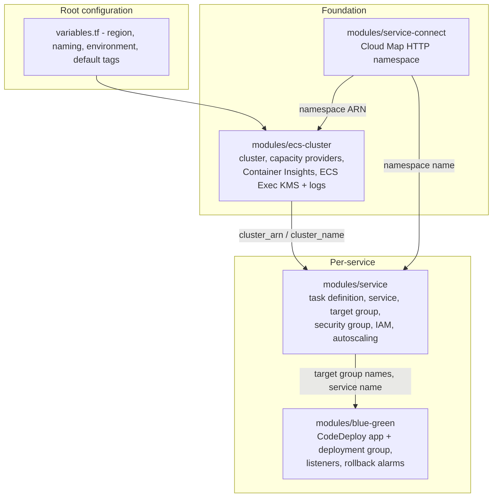
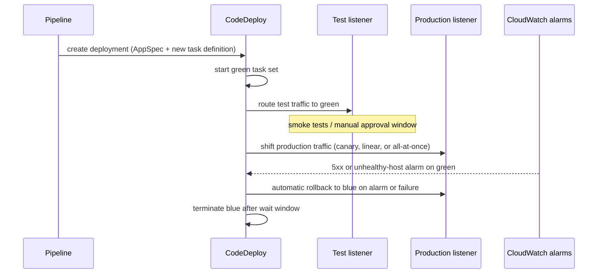

# Architecture

This document describes how the platform's modules fit together, how traffic
and deployments flow through the system, and the design decisions behind the
module boundaries.

## Component model

- **`modules/ecs-cluster`** owns everything shared by all services: the ECS
  cluster, the `FARGATE`/`FARGATE_SPOT` capacity provider attachment and default
  strategy, Container Insights, and the ECS Exec audit trail (a module-managed
  rotating KMS key plus a CloudWatch log group). It optionally pins a cluster
  default Service Connect namespace so services opt in by name only.
- **`modules/service-connect`** is deliberately tiny: one Cloud Map HTTP
  namespace. Service Connect resolves aliases through its sidecar, so nothing
  is published to a resolvable DNS zone.
- **`modules/service`** is the workhorse. One call produces a task definition,
  an ECS service, a dedicated security group, least-privilege execution and
  task roles, a CloudWatch log group, an ALB target group (plus listener rule
  when requested), and an Application Auto Scaling target with target-tracking
  policies.
- **`modules/blue-green`** adds the CodeDeploy application and deployment group
  for services running with the `CODE_DEPLOY` controller, optional production
  and test listeners, replacement-environment rollback alarms, and a rendered
  AppSpec with a task-definition placeholder for the CI/CD pipeline to fill.

## Traffic flow

North-south traffic enters through an Application Load Balancer. The service
module registers an `ip`-target-type target group and constrains the task
security group so container ingress is only permitted from the ALB's security
group (or an explicit Service Connect peer), never from an open CIDR.

East-west traffic uses ECS Service Connect. When a service sets
`service_connect_namespace`, its port mapping gains a name and application
protocol, and the Service Connect sidecar handles discovery, per-request load
balancing, and retries for calls to other services in the namespace via their
client aliases.

## Deployment lifecycle

### Rolling (default)

The `ECS` deployment controller replaces tasks in place, bounded by
minimum-healthy and maximum percentages. The deployment circuit breaker watches
for tasks that fail to reach steady state and rolls the service back to the
last healthy deployment without operator action.

### Blue/green

The service module provisions the paired blue and green target groups with
collision-safe names and hands ownership of the task definition and active
target group to CodeDeploy (`ignore_changes` on those fields). The blue-green
module manages the listeners because CodeDeploy swaps their default actions at
deployment time; listener rules pinned to a single target group are rejected by
a precondition in `CODE_DEPLOY` mode.

## Security posture

- **IAM** — the execution role carries only the managed ECS execution policy
  plus a scoped inline grant for the specific secret and parameter ARNs a
  service declares. The task role starts empty and gains only what a feature
  requires (for example SSM messages for ECS Exec). Both roles can be replaced
  with caller-supplied ARNs.
- **Network** — task security groups admit traffic solely from referenced
  security groups (ALB or mesh peers). Egress is explicit.
- **Secrets** — never in images or plain environment variables; task
  definitions reference Secrets Manager and SSM Parameter Store, resolved by
  the ECS agent at launch. KMS decrypt grants are scoped to declared key ARNs.
- **Audit** — ECS Exec sessions are encrypted with a rotating KMS key and
  logged to CloudWatch with configurable retention.
- **Rollback safety** — replacement-environment alarms treat missing data as
  not breaching, so a green environment receiving no traffic is not falsely
  failed, while real 5xx spikes and unhealthy hosts trigger rollback.

## Design decisions

- **Composable modules over one monolith.** The cluster is shared
  infrastructure with a different change cadence than services; separating them
  keeps service changes low-blast-radius and lets teams own their own service
  module calls.
- **Autoscaling owns desired count.** The ECS service ignores `desired_count`
  drift after creation, avoiding the classic fight between Terraform applies
  and the scaler.
- **Two service resources, one interface.** Terraform lifecycle blocks cannot
  be conditional, and rolling vs blue/green services need different
  `ignore_changes` sets, so the module renders exactly one of two service
  resources behind a single stable set of inputs and outputs.
- **Byte-stable task definitions.** Optional container keys (command, health
  check, secrets, port-mapping name) are merged in only when set, so enabling a
  feature never causes unrelated perpetual diffs.
- **Guardrails at plan time.** Fargate CPU/memory pairs, listener-rule
  conditions, autoscaling bounds, and blue/green wiring are validated with
  variable validations and preconditions so misconfigurations fail before an
  apply touches AWS.
- **Mocked-provider tests.** The `terraform test` suites assert on
  configuration-known values against a mocked AWS provider, so CI needs no AWS
  credentials and runs are deterministic.
